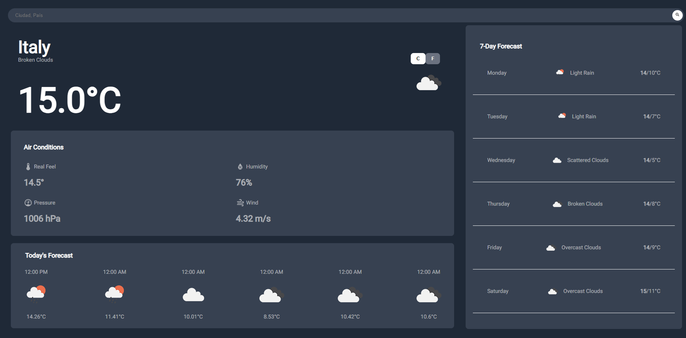

# 🌦️ Weather App

[](https://vuejs.org/)
[](https://www.typescriptlang.org/)
[](https://vitejs.dev/)
[](https://unocss.dev/)
[](https://vitest.dev/)
[](LICENSE)

Una aplicación web del clima construida con **Vue 3**, **Vite** y **TypeScript**, que permite consultar el pronóstico de 7 días por ciudad utilizando la API de OpenWeatherMap.

<div align="center">

<!-- Tipo de proyecto -->
`#web-application` `#spa` `#frontend` `#weather-app` `#open-source`

<!-- Stack tecnológico -->
`#vue3` `#typescript` `#vite` `#unocss` `#composition-api` `#chart-js` `#vitest`

<!-- Características -->
`#responsive-design` `#weather-forecast` `#api-integration` `#data-visualization` `#search-functionality`

<!-- Dominio -->
`#weather` `#forecast` `#meteorology` `#climate-data` `#openweathermap`

<!-- Estado -->
`#active-development` `#version-0.0.0` `#maintained`

</div>

## 🖼️ Vista Previa

<div align="center">
  
</div>

> 🚀 Consulta el clima de cualquier ciudad del mundo con una interfaz intuitiva y datos visuales claros.

---

## 🧰 Tecnologías Utilizadas

- ⚙️ **Vue 3** + Composition API
- 🛠️ **Vite** como bundler
- ✨ **TypeScript** para tipado estático
- 🎨 **UnoCSS** para estilos
- 🌤️ **OpenWeatherMap API** para datos climáticos
- 📊 **Chart.js + vue-chartjs** para visualizaciones (opcional)
- ✅ **Vitest** y **Vue Test Utils** para testing
- 📦 **Axios** para llamadas HTTP

---

## 🚀 Instalación

1. Clona el repositorio:

```bash
git clone https://github.com/DavidCortesA/weather.git
cd weather-app
```

2. Instala las dependencias:

```bash
npm install
```

3. Ejecuta el servidor de desarrollo:

```bash
npm run dev
```

---

## 🧪 Testing

Para ejecutar los tests unitarios:

```bash
npm run test:unit
```

---

## 🧼 Linting y Formato

- Lint con ESLint:

```bash
npm run lint
```

- Formateo con Prettier:

```bash
npm run format
```

---

## 📁 Estructura del Proyecto

```bash
src/
├── components/         # Componentes como SearchBar y WeatherDetails
├── assets/             # Recursos estáticos
├── App.vue             # Componente raíz
├── main.ts             # Punto de entrada
```

---

## 🧠 Funcionalidades

- 🔍 Buscar el clima por ciudad y país
- 🌡️ Mostrar temperaturas máximas y mínimas por día
- 🖼️ Íconos y descripciones del estado del tiempo
- 🗓️ Pronóstico de 7 días con diseño responsivo

---

## 📦 Scripts Útiles

| Script                | Descripción                          |
|----------------------|--------------------------------------|
| `dev`                | Inicia el servidor de desarrollo     |
| `build`              | Compila el proyecto para producción  |
| `preview`            | Previsualiza la app compilada        |
| `test:unit`          | Ejecuta los tests con Vitest         |
| `lint`               | Ejecuta ESLint y Oxlint              |
| `format`             | Aplica Prettier a los archivos       |
| `type-check`         | Verifica tipos con Vue TSC           |

---

## 🔐 Variables de Entorno

Crea un archivo `.env` en la raíz del proyecto con tu clave de API de OpenWeatherMap:

```env
VITE_API_KEY=tu_api_key_aqui
```

---

## 📄 Licencia

Este proyecto está bajo la licencia MIT.

---

## ✍️ Autor

Desarrollado con ❤️ por [David Cortez A](https://github.com/DavidCortesA)
